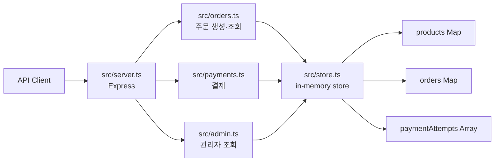
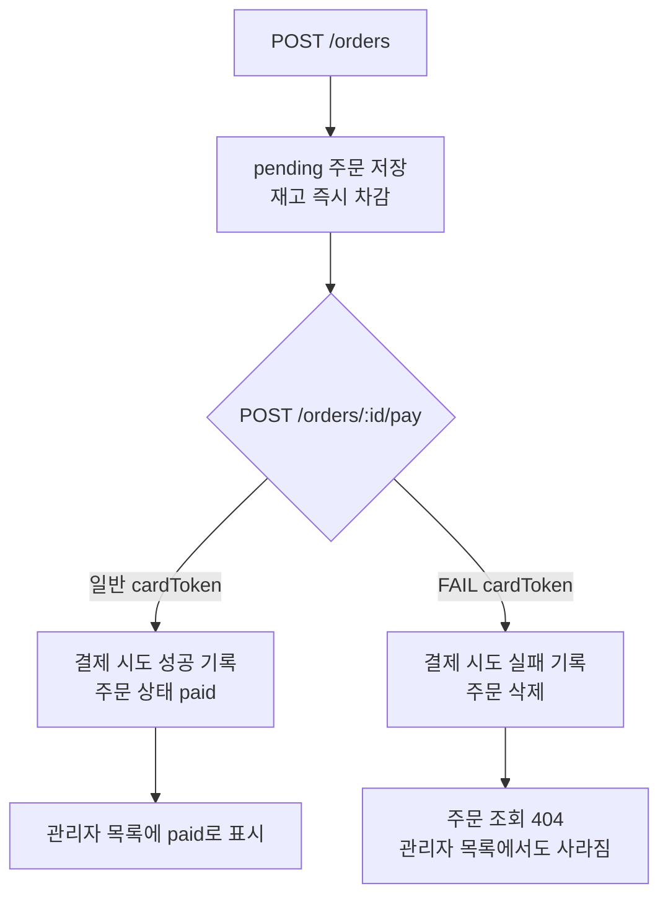

# order-ops — 개발자를 위한 Codex 워크플로 실습

## Overview

`order-ops`는 주문 생성, 결제, 재고, 관리자 조회가 연결된 작은 TypeScript API를 기반으로 개발 workflow를 연습하는 저장소입니다.

이 저장소의 앱은 완성된 서비스가 아닙니다. 현재 동작을 관찰하고, 모호한 요구사항을 문서와 계획으로 정리한 뒤, 정책에 맞게 구현하고 검증할 수 있도록 의도적으로 몇 가지 결함과 얕은 테스트를 남겨두었습니다.

실습은 하나의 코드베이스를 누적해서 발전시키는 방식입니다. GitHub의 **Use this template**으로 자신의 독립 저장소를 만든 뒤 clone해서 사용하세요.

## 빠른 시작

### 요구 환경

- Node.js 20 이상
- npm
- Git
- Codex에 로그인된 환경

### 독립 저장소 만들기

1. GitHub에서 [`RainaKim/order-ops`](https://github.com/RainaKim/order-ops)를 엽니다.
2. **Use this template**을 누르고 **Create a new repository**를 선택합니다.
3. Owner를 자신의 GitHub 계정으로 선택합니다.
4. Repository name에 `order-ops`를 입력합니다.
5. **Include all branches는 선택하지 않습니다.**
6. **Create repository**를 눌러 새 저장소를 만듭니다.
7. 생성된 저장소에 **Issues** 탭이 보이는지 확인합니다.

이 방식으로 만든 저장소는 원본과 연결된 Fork가 아닌 독립 저장소입니다. 실습 커밋, Issue, Pull Request는 모두 생성한 저장소에 남습니다.

Issues 탭이 보이지 않으면 생성한 저장소의 **Settings → General → Features**에서 **Issues**를 활성화하세요.

### Clone과 설치

```bash
git clone https://github.com/YOUR_GITHUB_ID/order-ops.git
cd order-ops
npm install
npm test
```

`YOUR_GITHUB_ID`는 자신의 GitHub 사용자 이름으로 바꾸세요.

### 개발 서버 실행

```bash
npm run dev
```

기본 서버 주소는 `http://localhost:3000`입니다.

### 환경 점검

```bash
node labs/tools/check.mjs env
```

환경 점검은 Node.js 버전, 의존성 설치 여부, 기본 테스트 통과 여부를 확인합니다.

## 1. 실습 진행 방식

이 저장소에는 다음 자료가 함께 들어 있습니다.

- 결함이 남아 있는 v0 앱
- 현재 동작을 확인하는 기본 테스트
- 20개 lab의 실습 안내
- 실습에 사용할 입력 자료
- 환경 점검과 lab별 self-check 도구

독립 저장소 생성과 환경 설정이 끝나면 다음 순서로 진행하세요.

1. [`labs/README.md`](./labs/README.md)에서 전체 실습 지도를 확인합니다.
2. 시작하려는 lab의 `README.md`에서 시작 상태와 산출물을 확인합니다.
3. `설계 질문 → 실행 → 검증` 순서로 실습합니다.
4. lab별 self-check를 실행합니다.
5. 첫 번째 lab부터 순서대로 진행하며 산출물을 자신의 저장소에 누적합니다.

제공된 `labs/`는 진행 방법과 입력을 확인하는 자료입니다. 실습 산출물은 `labs/`가 아니라 안내된 `docs/`, `notes/`, `.github/`, `src/`, `tests/`에 작성합니다.

## 2. 저장소 구조

```text
order-ops/
├── src/                         v0 애플리케이션 코드
│   ├── server.ts                Express 서버와 Router 연결
│   ├── store.ts                 상품·주문·결제 시도 메모리 저장소
│   ├── orders.ts                주문 생성·조회
│   ├── payments.ts              결제 처리
│   └── admin.ts                 관리자 주문 목록
│
├── tests/
│   └── orders.test.ts           현재 동작을 확인하는 기본 테스트
│
├── labs/                        모든 lab에서 공통으로 읽는 교재
│   ├── README.md                전체 lab 지도
│   ├── CONVENTIONS.md           산출물 위치 규칙
│   ├── lecture01~20/            lab별 진행 안내
│   ├── fixtures/                transcript·VOC·로그·패치 입력
│   └── tools/                   환경 점검과 self-check
│
├── package.json                 실행·검증 명령과 의존성
├── tsconfig.json                TypeScript 설정
└── README.md                    저장소 전체 안내
```

실습을 진행하면 다음 위치가 순서대로 생깁니다.

| 위치 | 역할 | 들어가는 내용 |
| --- | --- | --- |
| `docs/` | 다음 작업에서도 다시 읽는 오래 사는 기준 | 정책, template, prompt, checklist |
| `notes/` | 현재 요청과 실행 과정에 묶인 기록 | 요청 정리, plan, diff 검토, handoff |
| `.github/` | GitHub가 직접 읽는 설정 | Issue template, PR template |
| root `AGENTS.md` | Codex가 저장소에서 따라야 할 기준 | 읽기 순서, 명령, 작업 규칙, 완료 조건 |

이 위치들은 시작 상태에 미리 만들어져 있지 않습니다. 각 lab에서 필요한 시점에 직접 만들며, 상세 규칙은 [`labs/CONVENTIONS.md`](./labs/CONVENTIONS.md)를 따릅니다.

## 3. 앱 구조와 데이터 흐름

앱은 Express와 TypeScript로 작성되어 있습니다. 별도 데이터베이스나 외부 결제 시스템 없이 메모리에서만 동작하므로 서버를 다시 시작하면 주문과 결제 기록이 사라집니다.



### 초기 상품

[`src/store.ts`](./src/store.ts)는 서버 시작 시 다음 상품을 메모리에 등록합니다.

| 상품 ID | 상품 | 가격 | 초기 재고 |
| --- | --- | ---: | ---: |
| `keyboard` | 키보드 | 49,000원 | 5 |
| `mouse` | 마우스 | 23,000원 | 10 |
| `monitor` | 모니터 | 310,000원 | 2 |

### 런타임 구성

| 도구 | 역할 |
| --- | --- |
| Express | HTTP API와 Router |
| TypeScript | 앱 코드와 타입 검사 |
| `tsx` | TypeScript 개발 서버 실행 |
| Vitest | 테스트 실행 |
| Supertest | Express 엔드포인트 테스트 |
| ESLint | 정적 검사 |

## 4. 엔드포인트와 현재 동작

현재 API에는 네 개의 엔드포인트가 있습니다.

| Method | Path | 역할 |
| --- | --- | --- |
| `POST` | `/orders` | 주문 생성 |
| `GET` | `/orders/:id` | 주문 한 건 조회 |
| `POST` | `/orders/:id/pay` | 주문 결제 |
| `GET` | `/admin/orders` | 관리자 주문 목록 조회 |

### `POST /orders`

주문을 생성합니다.

```json
{
  "items": [
    {
      "productId": "keyboard",
      "quantity": 1
    }
  ]
}
```

현재 처리 순서는 다음과 같습니다.

1. `items`가 비어 있지 않은 배열인지 확인합니다.
2. `productId`가 문자열이고 `quantity`가 양의 정수인지 확인합니다.
3. 상품 가격으로 총액을 계산합니다.
4. 주문을 생성하는 즉시 상품 재고를 차감합니다.
5. `pending` 상태의 주문을 저장하고 HTTP 201을 반환합니다.

현재 관찰할 문제:

- 보유 재고보다 많은 수량도 주문할 수 있습니다.
- 결제가 완료되기 전에 재고가 줄어듭니다.
- 이후 결제가 실패해도 차감한 재고를 되돌리지 않습니다.

잘못된 items 또는 존재하지 않는 상품은 HTTP 400을 반환합니다.

### `GET /orders/:id`

주문 한 건을 조회합니다.

- 주문이 있으면 HTTP 200과 주문을 반환합니다.
- 주문이 없으면 HTTP 404와 `Order not found`를 반환합니다.

현재는 사용자별 주문 목록, 주문 취소, 상태 변경 엔드포인트가 없습니다.

### `POST /orders/:id/pay`

주문 결제를 처리합니다.

```json
{
  "cardToken": "CARD-123"
}
```

실제 결제 시스템 대신 `cardToken` 문자열로 결과를 구분합니다.

- `CARD-123`처럼 일반 문자열로 시작하면 성공합니다.
- `FAIL-123`처럼 `FAIL`로 시작하면 실패합니다.

성공하면 결제 시도를 기록하고 주문 상태를 `paid`로 변경합니다.

실패하면 다음과 같이 동작합니다.

1. 실패한 결제 시도를 기록합니다.
2. 주문을 저장소에서 삭제합니다.
3. HTTP 200과 `{ "ok": false }`를 반환합니다.

현재 관찰할 문제:

- 결제에 실패한 주문이 사라집니다.
- 결제 실패와 서버 내부 오류를 응답만으로 구분하기 어렵습니다.
- 예상하지 못한 예외도 HTTP 오류 대신 `{ "ok": false }`로 바뀝니다.

### `GET /admin/orders`

메모리에 남아 있는 주문을 관리자 목록 형태로 반환합니다.

```json
[
  {
    "id": "order-id",
    "totalKrw": 49000,
    "status": "pending",
    "createdAt": "2026-01-01T00:00:00.000Z"
  }
]
```

결제 시도 중 실패 기록이 하나라도 있으면 표시 상태를 `결제실패`로 계산하고, 그렇지 않으면 주문의 현재 상태를 사용합니다.

현재 관찰할 문제:

- 결제 실패 시 주문이 삭제되므로 실패 주문이 관리자 목록에도 남지 않습니다.
- 실패 이유와 결제 시도 횟수가 보이지 않습니다.
- 내부 예외가 발생하면 오류 대신 빈 배열을 반환합니다.
- 과거 실패 후 재결제에 성공한 경우에도 과거 실패 기록 때문에 `결제실패`로 표시될 위험이 있습니다.

### 주문·결제 흐름



## 5. 주문 상태 모델

현재 [`src/store.ts`](./src/store.ts)에 선언된 주문 상태는 세 개입니다.

```ts
type OrderStatus = 'pending' | 'paid' | 'cancelled';
```

| 상태 | 현재 코드에서의 의미 | 실제 진입 가능 여부 |
| --- | --- | --- |
| `pending` | 주문 생성 후 결제 전 | 가능 |
| `paid` | 결제 성공 | 가능 |
| `cancelled` | 취소된 주문 | 선언만 되어 있고 진입 로직 없음 |

현재 빠져 있는 것:

- 전체 주문 상태의 확정된 정의
- 허용되는 상태 전환 표
- 결제 실패 주문의 상태와 보존 방식
- 취소 처리 엔드포인트
- 결제 재시도 정책
- 잘못된 상태 전환을 차단하는 공통 로직

이 항목들은 시작 코드의 누락을 즉시 임의 구현하는 문제가 아닙니다. 먼저 현재 동작과 미결정 질문을 기록하고, 정책을 확정한 다음 구현하는 것이 실습의 핵심입니다.

## 6. 현재 테스트와 빠진 검증

[`tests/orders.test.ts`](./tests/orders.test.ts)에는 네 개의 기본 테스트가 있습니다.

| 테스트 | 현재 확인하는 것 | 아직 확인하지 않는 것 |
| --- | --- | --- |
| 주문 생성 | HTTP 201 | 주문 상태, 총액, 재고 변화 |
| 주문 조회 | HTTP 200 | 응답 본문과 저장 상태 |
| 결제 결과 | 응답에 `ok` 필드가 존재함 | 성공 여부, 주문 상태, 결제 시도 |
| 관리자 목록 | 응답이 배열임 | 항목 필드, 실패 주문, 표시 상태 |

현재 테스트는 앱이 최소한 응답한다는 사실만 확인합니다. 다음 동작은 아직 검증하지 않습니다.

- 재고 부족 주문 거절
- 주문 생성과 결제 전후의 정확한 재고 숫자
- 결제 실패 주문 보존
- 결제 실패 이유와 관리자 표시
- 재결제 성공 후 최종 표시 상태
- 내부 예외와 HTTP 오류 처리

기본 테스트가 통과한다는 사실만으로 정책에 맞는 앱이라고 판단하지 마세요. 응답 코드뿐 아니라 저장된 상태와 재고 변화를 함께 검증하는 과정이 이후 lab에 포함되어 있습니다.

## Lab 진행 방법

전체 지도는 [`labs/README.md`](./labs/README.md)에서 시작합니다. 각 `labs/lectureNN/README.md`는 다음 순서로 구성됩니다.

1. 이 lab이 끝나면
2. 시작 전 상태 확인
3. 실습 목표와 산출물 확인
4. 설계 질문 → 실행 → 검증
5. Self-check
6. 자주 하는 실수
7. 다음 lab 준비

## 개발 명령

| 명령 | 역할 |
| --- | --- |
| `npm run dev` | 파일 변경을 감지하는 개발 서버 실행 |
| `npm start` | 서버 한 번 실행 |
| `npm test` | Vitest 테스트 실행 |
| `npm run lint` | `src/`, `tests/` ESLint 검사 |
| `npm run typecheck` | TypeScript 타입 검사 |
| `node labs/tools/check.mjs env` | 실습 환경 점검 |
| `node labs/tools/check.mjs NN` | NN lab까지 누적 self-check |
